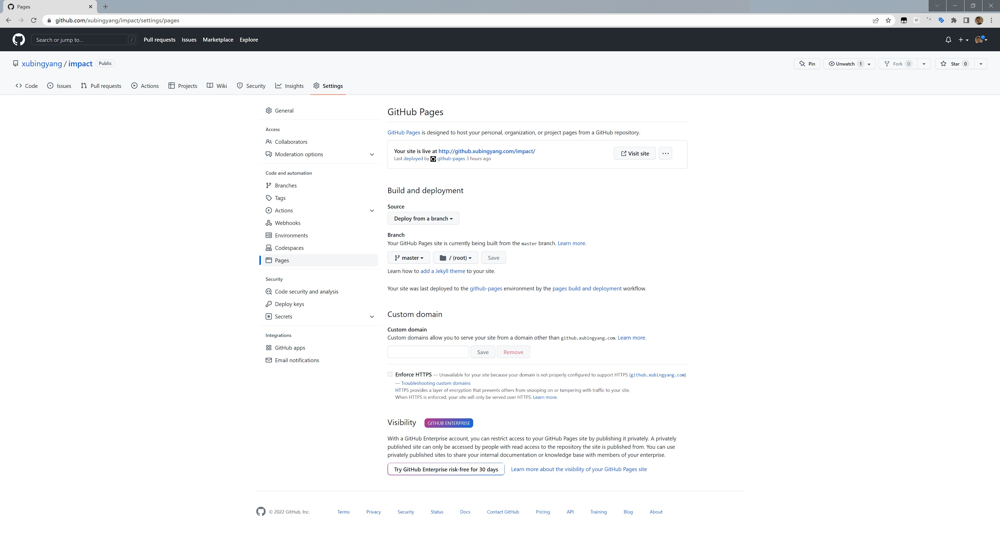
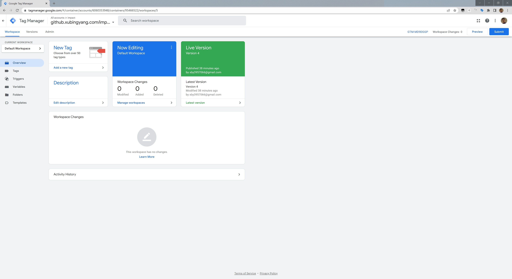
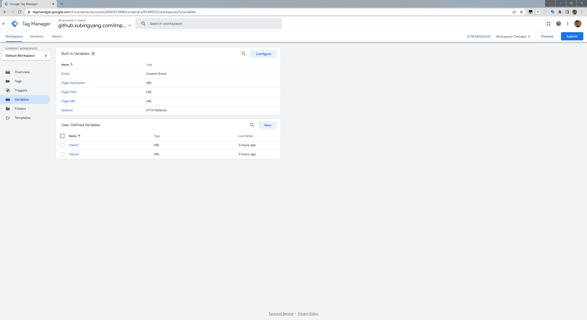
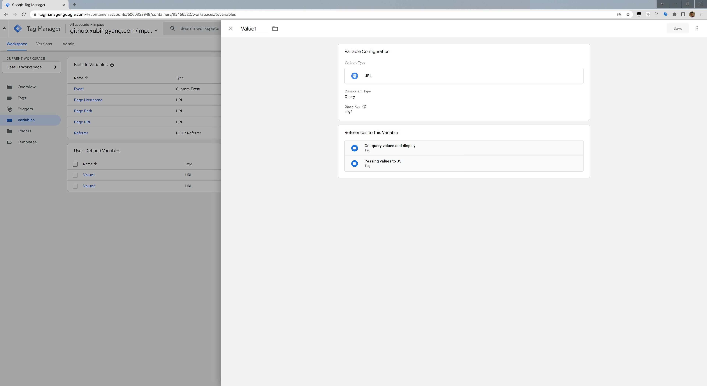
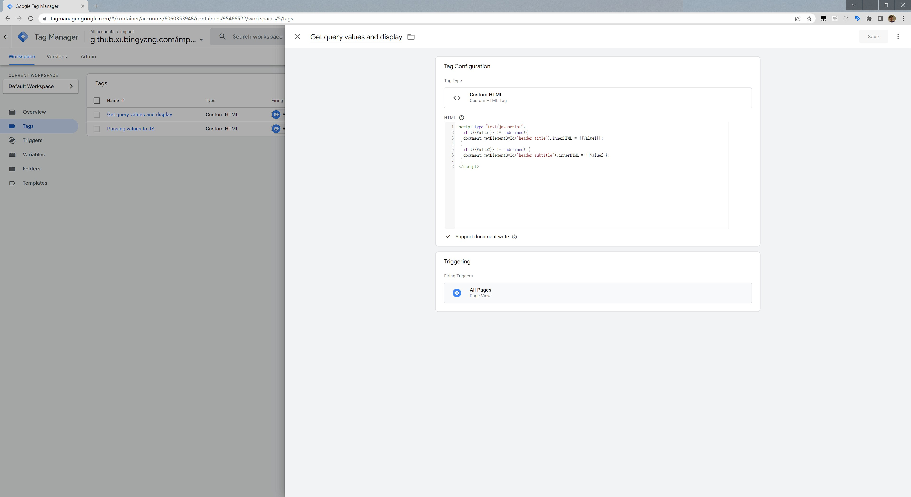
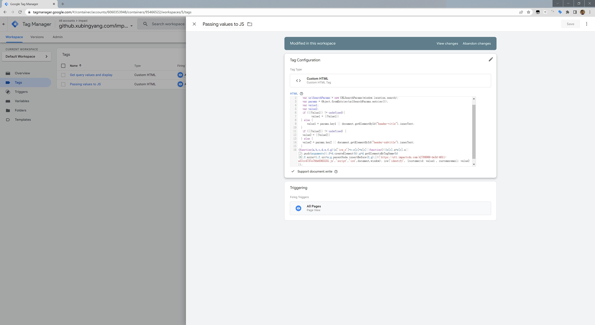
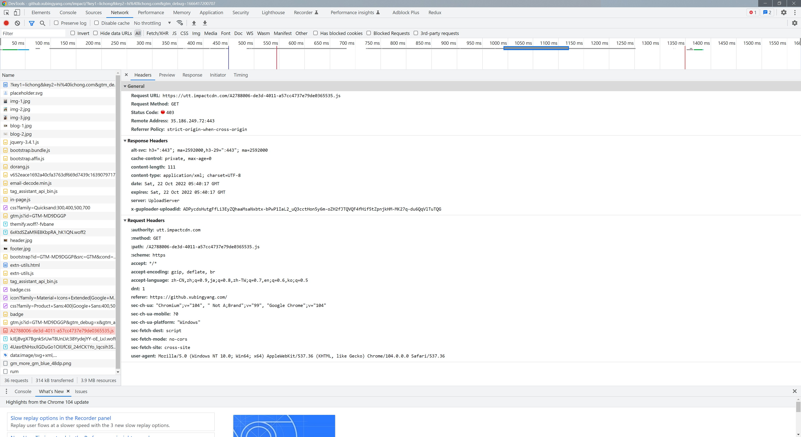

:
# Solutions Architect Technical Assessment
Click here to visit the deployed assessment page:
[https://github.xubingyang.com/impact/](https://github.xubingyang.com/impact/)
Try by:
[https://github.xubingyang.com/impact/?key1=xubingyang&key2=hi@xubingyang.com](https://github.xubingyang.com/impact/?key1=xubingyang&key2=hi@xubingyang.com)
[https://github.xubingyang.com/impact/?key1=john&key2=john@example.com](https://github.xubingyang.com/impact/?key1=john&key2=john@example.com)

### Assessment 1
[:heavy_check_mark:] Create a free test page on Github - [https://pages.github.com/](https://pages.github.com/)

[:heavy_check_mark:] Create a Google Tag Manager account - [https://tagmanager.google.com](https://tagmanager.google.com)

[:heavy_check_mark:] Deploy Google Tag Manager onto your Github page
```
<head>
<!-- Google Tag Manager -->
  <script>(function (w, d, s, l, i) {
      w[l] = w[l] || []; w[l].push({
        'gtm.start':
          new Date().getTime(), event: 'gtm.js'
      }); var f = d.getElementsByTagName(s)[0],
        j = d.createElement(s), dl = l != 'dataLayer' ? '&l=' + l : ''; j.async = true; j.src =
          'https://www.googletagmanager.com/gtm.js?id=' + i + dl; f.parentNode.insertBefore(j, f);
    })(window, document, 'script', 'dataLayer', 'GTM-MD9DGGP')
  </script>
<!-- End Google Tag Manager -->
</head>
```
```
<body>
<!-- Google Tag Manager (noscript) -->
  <noscript><iframe src="https://www.googletagmanager.com/ns.html?id=GTM-MD9DGGP" height="0" width="0"
  style="display:none;visibility:hidden"></iframe></noscript>
<!-- End Google Tag Manager (noscript) -->
</body>
```
[:heavy_check_mark:] Within Google Tag Manager
a. Create logic that can store key1 and key2 values from the URL. 




[:heavy_check_mark:] On your Github page, display the key1 and key2 values
Bingyang Xu: I think this task mean to ask me to utilize GTM to modify the HTML contents.


Bingyang Xu: If this task means to just display the default value1 and value2 on the HTML. I also set these two values(```key1=xubingyang```, ```key2=hi@xubingyang.com```) in the index.html
```
<div class="header-content">
  <h1 class="header-title" id="header-title">xubingyang</h1>
  <p class="header-subtitle" id="header-subtitle">hi@xubingyang.com</p>
</div>
```
[:heavy_check_mark:] Send link to Github page + screenshots of google tag manager configurations to *charles.pham@impact.com*

### Assessment 2
[:heavy_check_mark:] Building upon logic implemented in Assessment 1, deploy the Javascript code below,
passing through the key1 and key2 values into the following
a. customerid
b. customeremail
~~Bingyang Xu: Since I did not get the SDK of ```impact.com```, I cannot make the request to ```utt.impactcdn.com```, but this should carry value which either get from the url or get from the HTML element value.~~
[10/22 Update]
Bingyang Xu:  After some troubleshooting, I am not sure it's one part of the task or not. The code in the assessment PDF is actually not in one line. Or maybe when it convert to PDF format, the script automatically break lines. 
**After deleting two break lines.** The script can fire and make request to ```impact.com```.But it did not went through only get ```403 forbidden``` error response, which I think it's expected due to I do not have any access credential nor whitelisted this domain from ```impact.com``` for the script ID.



[:heavy_check_mark:] Share link to Github page + screenshots of google tag manager configurations to *charles.pham@impact.com*

### Thanks to
[HTML Template](https://www.free-css.com/free-css-templates/page284/dorang), [Google Tag Manager](https://tagmanager.google.com), [Github Pages](https://pages.github.com), [impact.com](https://impact.com/).